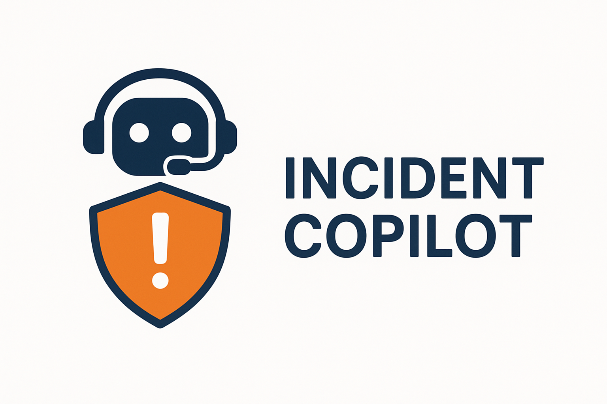
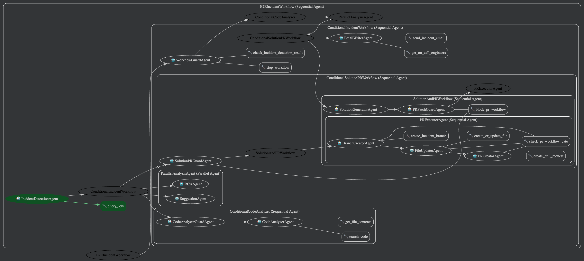

# Incident CoPilot
### Let your on-call engineers rest more

<p align="center">
  
</p>

Incident CoPilot is a production-ready multi-agent responder that turns noisy Grafana alerts into actionable root-cause analysis, proposed fixes, GitHub pull requests, and html-formatted on-call briefs without waiting for a human to run the playbook.

## The Pitch

### Problem
- On-call engineers still triage incidents manually: copy log links, guess the failure domain, write mitigation steps, and draft comms. Context switching during an outage costs minutes we do not have.

### Solution
- A chained set of Gemini-powered agents that ingest Grafana Loki logs the moment an alert fires, confirm if the issue is code-related, run repository searches, draft a fix, open a PR, and notify on-call engineers through Gmail with failover guarantees.

### Value
- Shrinks time-to-mitigation by making “identify → diagnose → patch → communicate” a single automated workflow.
- Keeps humans in control by surfacing structured evidence, proposed diffs, and ready-to-review pull requests instead of taking blind actions.
- Every run saves JSON artifacts and email transcripts so SREs can audit or resume the response later, and a built-in failover sender guarantees on-call notifications even if the Email Writer agent hiccups.

### Track Relevance
- Agents are not ornamental; they decide whether to run code workflows, what files to patch, and when to block unsafe actions. Gemini 2.5 Flash Lite is the core reasoning engine for every step, showing meaningful use of the platform.

## Implementation

### Architecture Snapshot
- FastAPI webhook (`/webhook/trigger_agent`) accepts Grafana alerts and starts an asynchronous session (`run_workflow` in `incident_copilot/agent.py`).
- The orchestrator chains Sequential + Conditional + Parallel agents:
  1. `IncidentDetectionAgent` queries Loki via a FunctionTool and produces the canonical incident JSON.
  2. `CodeAnalyzerAgent` (guarded) uses the GitHub MCP toolset to inspect repos only when the incident looks like a code regression.
  3. `RCAAgent` and `SuggestionAgent` run in parallel to speed up analysis.
  4. `SolutionGeneratorAgent` emits mitigations plus structured patch objects; `PRExecutorAgent` (branch → file → PR) consumes that patch.
  5. `EmailWriterAgent` builds an executive briefing, calls Gmail through `send_incident_email` only when the guard has confirmed an incident, and the failover helper re-sends if Gmail was unreachable.
- Outputs land in `output/` as JSON + rendered emails for auditability.

```
Grafana Alert
     │
     ▼
FastAPI Webhook ──► run_workflow()
     │
     ▼
IncidentDetectionAgent ──┬─► Conditional Code Analyzer ──► Solution + PR chain
                         └─► Parallel(RCAAgent, SuggestionAgent)
                                                │
                                                ▼
                                      EmailWriterAgent → Gmail + HTML formatter
                                                │
                                                ▼
                                      Failover email + output artifacts
```



### Agent Roster (central ones)

| Agent | Purpose | Tools / Concepts |
| --- | --- | --- |
| `IncidentDetectionAgent` | Executes LogQL queries against Loki, classifies severity and incident type hints. | FunctionTool → `tools.loki_client.query_loki` |
| `CodeAnalyzerAgent` | Launches the GitHub MCP server to search code and pull full files so patches reference real line numbers. | MCP toolset, repo auto-detection |
| `RCAAgent` | Converts log-derived evidence into explicit hypotheses with confidence + affected components. | Context-grounded reasoning only |
| `SolutionGeneratorAgent` | Generates mitigations and structured `patch.files_to_modify` payloads the PR workflow consumes. | JSON contract enforcement |
| `PRExecutorAgent` | Sequentially creates a branch, writes files, and opens a PR (skips gracefully if nothing to patch). | GitHub REST API helpers, PR gate |
| `EmailWriterAgent` | Crafts the human-facing incident brief, calls Gmail, and triggers HTML rendering. | `get_on_call_engineers`, `send_incident_email` |

### Course Concepts Demonstrated
- **Multi-agent system (LLM, Sequential, Parallel):** Every stage is an LLM-backed agent; `SequentialAgent` orchestrates the run, `ParallelAgent` fans out RCA/Suggestion, and loop-style conditional wrappers gate optional steps (`conditional_code_analyzer`, `conditional_solution_pr_workflow`).
- **Tools (MCP + custom):** Agents call FunctionTools for Grafana Loki, Gmail, GitHub REST, workflow gates, and the GitHub MCP toolset (`search_code`, `get_file_contents`) so patches cite real code.
- **Sessions & Memory:** `InMemorySessionService` and `InMemoryMemoryService` maintain per-run state (`agent_responses`, fallbacks) so later agents, including the failover emailer, reuse earlier outputs without re-querying systems.
- **Observability & Deployment:** `LoggingPlugin` streams every agent event to stdout, JSON artifacts land in `output/`, and `app.py` exposes a FastAPI webhook for deployment on Uvicorn/Cloud Run.
- **Safety & Guardrails:** PR workflow gates prevent empty PRs; email failover ensures humans still get notified; conditional wrappers (`workflow_guard`, `code_analyzer_conditional`, `solution_pr_conditional`) stop the cascade when detection says “no incident”.

### Supporting Components
- `tools/email_html_formatter.py` converts the plain-text brief into a responsive HTML template with sections (incident summary, RCA, solution status, action plan, PR).
- `incident_copilot/email_failover.py` reconstructs an email body from stored agent JSON, then calls the helper if the Email Writer skipped.
- `incident_copilot/github.py` centralizes branch/file/PR logic including repo auto-discovery, Base64 encoding, branch diff checks, and helpful error surfacing.
- `tools/workflow_control.py` lets agents block further automation (e.g., disable PR creation when configuration is missing).

## Setup

### Prerequisites
- Python 3.11+
- pip + virtualenv (recommended)
- Access to Grafana Loki, GitHub, and Gmail APIs (service or test accounts)
- Node.js 18+ (required for the GitHub MCP server; Cloud Run installs it automatically via `packages.txt`, but install locally if you run agents on your machine)

### Environment Variables (.env example)

| Variable | Purpose |
| --- | --- |
| `APP_NAME` | Friendly label shown in ADK sessions |
| `GRAFANA_HOST`, `GRAFANA_BASICAUTH` | HTTPS endpoint + `user:password` used to query Loki |
| `GITHUB_TOKEN`, `GITHUB_REPO`, `GITHUB_BASE_BRANCH`, `GIT_REPO_PATH` | Grants repo access for MCP + REST commits |
| `GMAIL_CLIENT_ID`, `GMAIL_CLIENT_SECRET`, `GMAIL_REFRESH_TOKEN`, `GMAIL_USER_EMAIL` | OAuth credentials for Gmail send API |
| `ON_CALL_ENGINEERS` | JSON list of target emails (defaults to a single address) |
| `GEMINI_API_KEY` | API key for Gemini / Google Generative Language |
| `SERVICE_NAME`, `WEBHOOK_USER_ID` | Labels used in detection + alerting |
| `LOOKUP_WINDOW_SECONDS` | How far back to look around the incident timestamp |

Create the file:

```
python -m venv .venv
source .venv/bin/activate
pip install -r requirements.txt
cp .env.example .env  # if you keep templates
```

### GitHub MCP helper
The Code Analyzer launches `@modelcontextprotocol/server-github` through `npx`. Install the dependency in this repo (locks live in `package-lock.json`):

```
npm install
```

Cloud Run installations use `packages.txt` (lists `nodejs` + `npm`) plus this `package.json` so buildpacks provision the same tooling automatically.

## Running The Workflow

### 1. Manual dry run from a REPL

```
python - <<'PY'
import asyncio
from incident_copilot.agent import run_workflow

async def demo():
    await run_workflow(
        user_id="cli_test",
        service="checkout-api",
        start_time="2025-11-16T15:00:00Z"
    )

asyncio.run(demo())
PY
```

### 2. Trigger via webhook (hook it to Grafana)

```
uvicorn app:api --host 0.0.0.0 --port 8000

curl -X POST http://localhost:8000/webhook/trigger_agent \
  -H "Content-Type: application/json" \
  -d '{"title":"Checkout errors > 5%"}'
```

The endpoint stamps `service`, `user_id`, and `start_time`, then hands the payload to the orchestrator asynchronously so Grafana does not block.

### 3. Review artifacts
- `output/incident_<id>_<timestamp>.json` includes workflow summaries, agent responses, and email delivery metadata.
- `output/*email.txt` lets you confirm what Gmail received.
- Logs in the terminal include per-agent events thanks to `LoggingPlugin`.

### 4. Run in ADK Web
1. Export the same environment variables you use locally (`GRAFANA_HOST`, `GITHUB_TOKEN`, `GMAIL_CLIENT_ID`, etc.) so ADK Web can access external services.
2. From the repo root, launch the web playground:
   ```
   adk web
   ```
3. In the browser, pick the `incident_copilot` app, then start a session with:
   ```
   {"start_time": "2025-11-16T15:00:00Z"}
   ```
   The web UI will stream each agent’s reasoning, tool calls, and outputs in real time.

## Testing & Quality
- Run `pytest` to execute the focused regression tests (HTML formatter, failover sender, workflow helpers).
- `tests/test_email_html_formatter.py` ensures section parsing renders correctly, preventing malformed executive briefs.
- `tests/test_email_failover.py` and `tests/test_email_helper_status.py` guarantee the fallback email always has the mandatory sections and the status cache behaves.
- For integration testing, point `GRAFANA_HOST` to a staging Loki instance and replay recorded incidents; every run is deterministic for the same logs.

## Deployment

### Local Development
```bash
uvicorn app:api --reload
```

### Cloud Run Deployment

#### Prerequisites
- Google Cloud SDK installed and configured
- GCP project with billing enabled
- Cloud Run API enabled
- Container Registry API enabled (or Artifact Registry)

#### Option 1: Manual Deployment with gcloud

**Step 1: Prerequisites Setup**

```bash
export PROJECT_ID=your-gcp-project-id
export REGION=us-central1
export SERVICE_NAME=incident-copilot

gcloud config set project $PROJECT_ID

gcloud services enable cloudbuild.googleapis.com
gcloud services enable run.googleapis.com
gcloud services enable containerregistry.googleapis.com
gcloud services enable secretmanager.googleapis.com
```

`packages.txt` (repo root) makes the buildpack apt-install `nodejs`/`npm`, so `npx` can launch the GitHub MCP server. `Procfile` tells the runtime to start FastAPI via `uvicorn app:api --host 0.0.0.0 --port $PORT`.

**Step 2: Build & Deploy from Source (Cloud Run)**

```bash
gcloud run deploy $SERVICE_NAME \
  --source . \
  --region $REGION \
  --allow-unauthenticated \
  --memory 2Gi \
  --cpu 2 \
  --timeout 900 \
  --max-instances 10 \
  --min-instances 0
```

**Step 3: Configure Environment Variables**

Set non-sensitive environment variables:

```bash
gcloud run services update $SERVICE_NAME \
  --region $REGION \
  --set-env-vars "APP_NAME=incident_copilot,SERVICE_NAME=your-service-name,WEBHOOK_USER_ID=grafana_webhook,LOOKUP_WINDOW_SECONDS=3600,GITHUB_BASE_BRANCH=main,GIT_BASE_BRANCH=main"
```

**Step 4: Set Up Secrets (Recommended for Sensitive Values)**

Create secrets in Secret Manager:

```bash
export PROJECT_NUMBER=$(gcloud projects describe $PROJECT_ID --format="value(projectNumber)")

echo -n "username:password" | gcloud secrets create grafana-basicauth --data-file=-
echo -n "your-github-token" | gcloud secrets create github-token --data-file=-
echo -n "your-gmail-client-id" | gcloud secrets create gmail-client-id --data-file=-
echo -n "your-gmail-client-secret" | gcloud secrets create gmail-client-secret --data-file=-
echo -n "your-gmail-refresh-token" | gcloud secrets create gmail-refresh-token --data-file=-
echo -n "your-gmail-user-email" | gcloud secrets create gmail-user-email --data-file=-
echo -n "your-github-repo" | gcloud secrets create github-repo --data-file=-
echo -n '["email1@example.com","email2@example.com"]' | gcloud secrets create on-call-engineers --data-file=-
echo -n "https://your-grafana-instance.com" | gcloud secrets create grafana-host --data-file=-
echo -n "your-gemini-api-key" | gcloud secrets create gemini-api-key --data-file=-
```

Grant Cloud Run service account access to secrets:

```bash
export SERVICE_ACCOUNT="${PROJECT_NUMBER}-compute@developer.gserviceaccount.com"

gcloud secrets add-iam-policy-binding grafana-basicauth \
  --member="serviceAccount:${SERVICE_ACCOUNT}" \
  --role="roles/secretmanager.secretAccessor"

gcloud secrets add-iam-policy-binding github-token \
  --member="serviceAccount:${SERVICE_ACCOUNT}" \
  --role="roles/secretmanager.secretAccessor"

gcloud secrets add-iam-policy-binding gmail-client-id \
  --member="serviceAccount:${SERVICE_ACCOUNT}" \
  --role="roles/secretmanager.secretAccessor"

gcloud secrets add-iam-policy-binding gmail-client-secret \
  --member="serviceAccount:${SERVICE_ACCOUNT}" \
  --role="roles/secretmanager.secretAccessor"

gcloud secrets add-iam-policy-binding gmail-refresh-token \
  --member="serviceAccount:${SERVICE_ACCOUNT}" \
  --role="roles/secretmanager.secretAccessor"

gcloud secrets add-iam-policy-binding gmail-user-email \
  --member="serviceAccount:${SERVICE_ACCOUNT}" \
  --role="roles/secretmanager.secretAccessor"

gcloud secrets add-iam-policy-binding github-repo \
  --member="serviceAccount:${SERVICE_ACCOUNT}" \
  --role="roles/secretmanager.secretAccessor"

gcloud secrets add-iam-policy-binding on-call-engineers \
  --member="serviceAccount:${SERVICE_ACCOUNT}" \
  --role="roles/secretmanager.secretAccessor"

gcloud secrets add-iam-policy-binding grafana-host \
  --member="serviceAccount:${SERVICE_ACCOUNT}" \
  --role="roles/secretmanager.secretAccessor"

gcloud secrets add-iam-policy-binding gemini-api-key \
  --member="serviceAccount:${SERVICE_ACCOUNT}" \
  --role="roles/secretmanager.secretAccessor"
```

Update Cloud Run service to use secrets:

```bash
gcloud run services update $SERVICE_NAME \
  --region $REGION \
  --update-secrets \
    GRAFANA_BASICAUTH=grafana-basicauth:latest,\
    GITHUB_TOKEN=github-token:latest,\
    GMAIL_CLIENT_ID=gmail-client-id:latest,\
    GMAIL_CLIENT_SECRET=gmail-client-secret:latest,\
    GMAIL_REFRESH_TOKEN=gmail-refresh-token:latest,\
    GMAIL_USER_EMAIL=gmail-user-email:latest,\
    GITHUB_REPO=github-repo:latest,\
    ON_CALL_ENGINEERS=on-call-engineers:latest,\
    GRAFANA_HOST=grafana-host:latest,\
    GEMINI_API_KEY=gemini-api-key:latest
```

**Step 5: Verify Deployment**

```bash
export SERVICE_URL=$(gcloud run services describe $SERVICE_NAME \
  --region $REGION \
  --format="value(status.url)")

curl -X POST $SERVICE_URL/webhook/trigger_agent \
  -H "Content-Type: application/json" \
  -d '{"title":"Test incident"}'

gcloud run services logs read $SERVICE_NAME --region $REGION --limit 50
```

**Alternative: Set All Environment Variables Directly (Not Recommended for Production)**

If you prefer not to use Secret Manager, you can set all variables directly (less secure):

```bash
gcloud run services update $SERVICE_NAME \
  --region $REGION \
  --set-env-vars \
    "APP_NAME=incident_copilot,\
    SERVICE_NAME=your-service-name,\
    WEBHOOK_USER_ID=grafana_webhook,\
    LOOKUP_WINDOW_SECONDS=3600,\
    GITHUB_BASE_BRANCH=main,\
    GIT_BASE_BRANCH=main,\
    GRAFANA_HOST=https://your-grafana-instance.com,\
    GRAFANA_BASICAUTH=username:password,\
    GITHUB_TOKEN=your-github-token,\
    GITHUB_REPO=owner/repo-name,\
    GMAIL_CLIENT_ID=your-client-id,\
    GMAIL_CLIENT_SECRET=your-client-secret,\
    GMAIL_REFRESH_TOKEN=your-refresh-token,\
    GMAIL_USER_EMAIL=your-email@gmail.com,\
    ON_CALL_ENGINEERS=[\"email1@example.com\",\"email2@example.com\"],\
    GEMINI_API_KEY=your-gemini-api-key"
```

#### Configuration

The FastAPI app is stateless; Gemini + Google ADK handle runtime state in memory per session. Ensure the Cloud Run service has:
- **Memory:** At least 2Gi (recommended: 4Gi for complex workflows)
- **CPU:** At least 2 vCPU
- **Timeout:** 900 seconds (15 minutes) for long-running agent workflows
- **Concurrency:** 1-10 requests per instance (adjust based on workload)
- **Min/Max instances:** Configure based on expected traffic

#### Environment Variables

Set all required environment variables (see Setup section) via:
- `gcloud run services update` with `--set-env-vars` (for non-sensitive values)
- GCP Secret Manager (recommended for sensitive credentials like tokens, passwords)

#### Network Requirements

Cloud Run instances need outbound HTTPS access to:
- Grafana Loki (your `GRAFANA_HOST`)
- GitHub API (`api.github.com`)
- Gmail API (`gmail.googleapis.com`)
- Gemini API (`generativelanguage.googleapis.com`)

No VPC configuration needed unless your Grafana instance is private.

#### Testing the Deployment

```bash
# Get the service URL
SERVICE_URL=$(gcloud run services describe incident-copilot --region $REGION --format="value(status.url)")

# Test the webhook
curl -X POST $SERVICE_URL/webhook/trigger_agent \
  -H "Content-Type: application/json" \
  -d '{"title":"Test incident"}'
```

#### Monitoring

- View logs: `gcloud run services logs read incident-copilot --region $REGION`
- Monitor in Cloud Console: Cloud Run → incident-copilot → Logs/Metrics
- Set up alerting for failed workflows in Cloud Monitoring

## Bonus Hooks
- **Gemini usage:** Every agent declares `Gemini(model="gemini-2.5-flash-lite")` plus shared retry policy so the submission clearly exercises Gemini for reasoning, code generation, and summarization.
- **Tooling & Observability:** Loki client, GitHub REST helpers, Gmail sender, workflow gates, and HTML templates are each encapsulated in `tools/` with docstrings to explain their behavior.
- **Deployment reproducibility:** The webhook + CLI flows above show exactly how judges can rerun the project; no hidden services required.
- **Video-ready storyline:** Demo script “send Grafana alert → auto RCA → PR link + HTML email” is already storyboarded by the README sections, making it easy to narrate a short video if desired.

## Troubleshooting
- Missing `GITHUB_REPO`: Code Analyzer quietly sets `mcp_available=false`; patch generation degrades to log-based suggestions instead of failing.
- Gmail refresh token errors (`invalid_grant`): check the helper logs; instructions point you to regenerate the token.
- “PR workflow blocked”: see `tools/workflow_control.py`; agents might have called `block_pr_workflow` because the Solution Agent produced no patch or repo creds were absent.
- Loki access denied: confirm `GRAFANA_BASICAUTH` is `username:password` (the helper encodes it for you).

---

Incident CoPilot packages the entire incident lifecycle (detection, RCA, fix generation, automated code changes, and comms) into a single, auditable workflow that teams can run anywhere Python 3.11 and Gemini are available.

